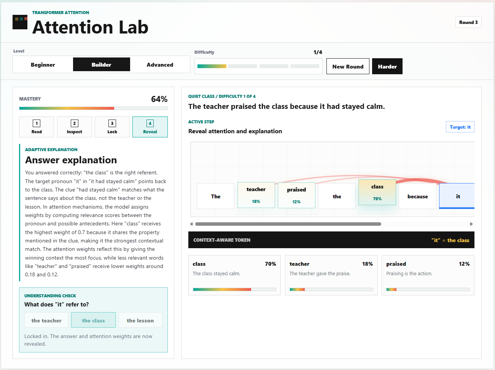

# Attention Lab

**Adaptive tutor that teaches transformer attention through interactive Read → Inspect → Lock → Reveal rounds. Built for the Google Cloud Agentic Premiere League (APL) — Learnings Challenge 2.**

🚀 **Live demo:** https://attention-lab-unzmeauoia-uc.a.run.app/

> **Learnings Challenge — Challenge 2**
> *Create an intelligent assistant that helps users learn new concepts effectively. The system should personalize content and adapt to user pace and understanding.*

Attention Lab is our submission for the Learnings Challenge. It is a focused Next.js app that teaches **one** hard concept — *transformer attention* — by turning it into an interactive lab where the learner sees, manipulates, and is questioned on the idea until it sticks.



## How it addresses the challenge

The challenge asks for an assistant that **personalizes content** and **adapts to user pace and understanding**. Attention Lab does this along three axes:

- **Personalized depth.** The learner picks a level — *Beginner*, *Builder*, or *Advanced* — and every sentence, clue, explanation, and distractor is regenerated for that level. A Beginner sees a plain pronoun puzzle; an Advanced learner gets ambiguous antecedents and richer linguistic clues.
- **Adaptive pace.** A four-step loop — **Read → Inspect → Lock → Reveal** — lets the learner control how fast they move through each round. Difficulty advances 1/4 → 4/4 only when they're ready, and a *Harder* button lets them push further; *New Round* gives them a fresh sentence at the same difficulty if they want more practice.
- **Adaptive understanding.** Every round ends with an *Understanding Check*. The tutor reads the learner's answer (right or wrong, and *which* wrong choice) and writes a tailored explanation that grounds the abstract idea — attention weights — in the specific sentence they just saw. Mastery % tracks progress over the session.

In short: instead of explaining attention in prose, the app *makes the learner do attention*, then explains what just happened in their own example.

## What the screenshot shows

The screenshot above is one full round at *Builder* level, difficulty 1/4, round 3:

- **Sentence:** *"The teacher praised the class because it had stayed calm."*
- **Target pronoun:** `it`
- **Attention weights** (revealed after the learner locks in): `class` 70%, `teacher` 18%, `praised` 12%.
- **Context-aware token:** `"it" = the class`.
- **Adaptive explanation:** the tutor confirms the correct answer and walks through *why* the clue (`had stayed calm`) pulls attention toward `class` rather than `teacher`, referencing the exact weights on screen.
- **Understanding check:** *"What does 'it' refer to?"* — the learner picked **the class** and the answer is now locked.
- **Mastery:** 64%, reflecting the learner's running performance across rounds.

## Demo flow

1. Pick learner level: **Beginner**, **Builder**, or **Advanced**.
2. Watch the four steps animate — *Read* the sentence, *Inspect* candidate tokens, *Lock* the target pronoun, *Reveal* attention weights.
3. Answer the *Understanding Check*.
4. Read the adaptive explanation written for your specific answer.
5. Hit **New Round** to keep practicing, or **Harder** to push the difficulty.

## AI configuration

The app uses the OpenAI SDK from a server route, pointed at any OpenAI-compatible endpoint (NVIDIA NIM, MiniMax, OpenAI itself, etc.). Provider settings live in environment variables:

```bash
OPENAI_API_KEY=...
OPENAI_BASE_URL=...   # e.g. https://integrate.api.nvidia.com/v1
AI_MODEL=...          # e.g. deepseek-ai/deepseek-v4-flash
```

Two server routes drive the experience:

- `POST /api/challenge` — generates a fresh sentence, target pronoun, candidate tokens, attention weights, clue, and distractors for the chosen `{level, difficulty, round}`.
- `POST /api/tutor` — writes the adaptive explanation after the learner answers, conditioned on whether they were right and which option they chose.

If the env vars are missing or the provider is unreachable, the app falls back to a curated corpus and a deterministic tutor so the demo still works fully offline.

## Run locally

```bash
npm install
npm run dev
```

Then open `http://localhost:3000`.
